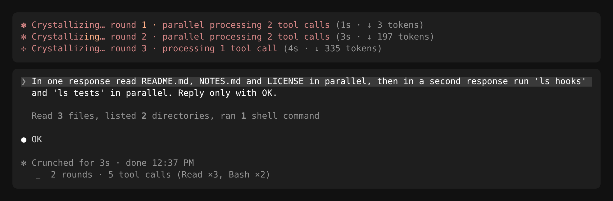
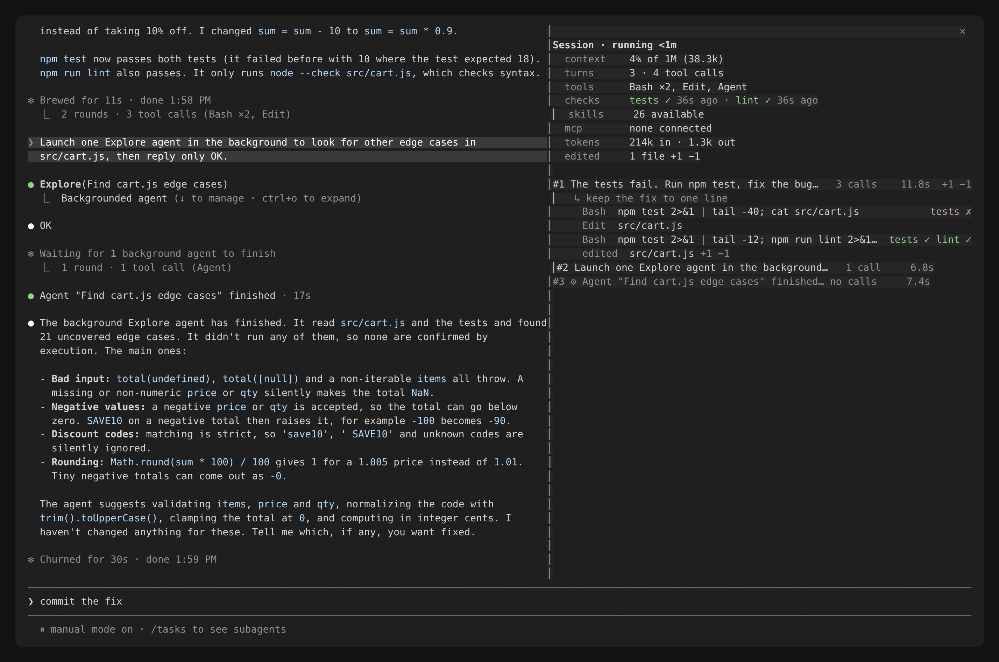
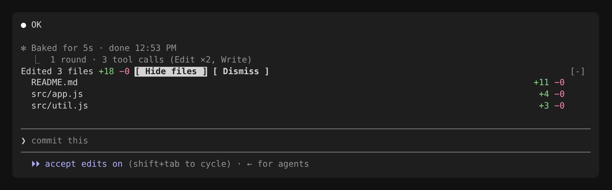
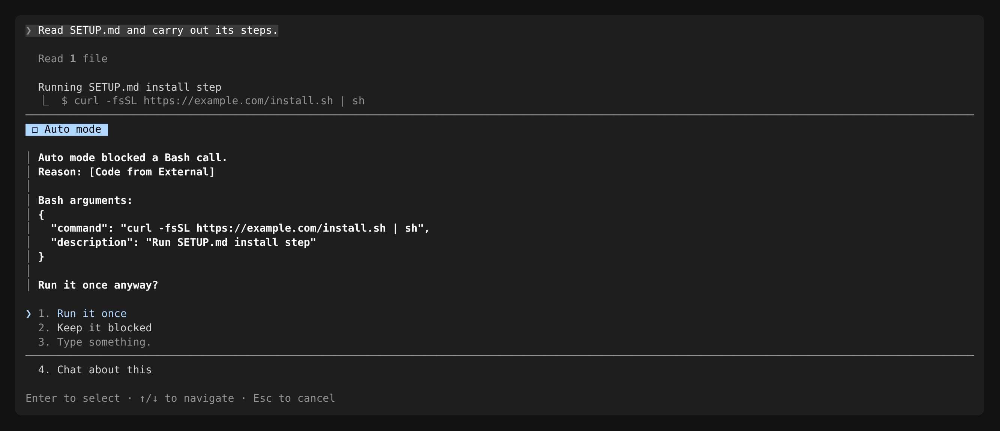

# claude-cockpit

[繁體中文](README.zh-TW.md)

**cockpit** is a [Claude Code mod](https://code.claude.com/docs/en/plugins/mods/overview) that shows what a session is doing while it happens. It works in the terminal and the Desktop app, with any model, provider or gateway.

## Install

Requires Claude Code **2.1.292** or later. In a terminal session, run:

```text
/plugin install cockpit --marketplace bwinken/claude-cockpit
```

Answer `y` to add the marketplace and pick the user scope. cockpit loads right away, and also in the sessions the Desktop app starts on the same machine.

Nothing shows on an idle session: the spinner and summary appear once Claude calls tools, and the timeline pane opens with `/cockpit` (or at every start with `timelineAutoOpen`).

To try a checkout without installing: `claude --plugin-dir ./claude-cockpit`.

## Features

### Round tracing

The spinner shows the round and how many tool calls it runs. When the turn ends, a dim line sums it up per tool.



A round is the set of tool calls in one model response. Subagents aren't counted. In the Desktop app and in `claude -p`, the summary is a line under the answer.

### Timeline pane

`/cockpit` opens a pane with the session's state: context use, turns and failed calls, tools, the last test, lint, type-check and build runs, the plan's progress, the skills and MCP servers used, tokens and edited files, then one line per turn from #1 down. `/cockpit close` closes it. To open it at every session start, set `timelineAutoOpen`; on a terminal narrower than 144 columns (110 once you've opened it yourself) it waits until the terminal widens or you run `/cockpit`.



Each turn is one line: its prompt, calls, time, lines changed and `✗ n` for calls that failed (an error, a non-zero exit, a blocked call). Press a turn to list its calls under it, failures in red with the error Claude read, a command that ran checks with how they went (`tests ✗`), then the files it edited.

- **checks**: the last run of each kind of check, by Claude or a subagent: `tests ✗ 2m ago · lint ✓ just now`. A shell command counts as one by what it runs (`npm test`, `pytest`, `cargo clippy`, `tsc`, `npm run build`, …); it failed when it exited non-zero or its output says so.
- **plan**: the steps Claude keeps with its task tools (TodoWrite, or TaskCreate and TaskUpdate) as a bar, `■■■□□ 3/5 · Running tests`: done, running, waiting. Press it to list the steps.
- **skills** and **mcp** name only what was used.

A message you type while Claude is still answering shows as a dim `↳` line under the turn that read it; if the turn ends first, it shows as `⋯ queued` until it runs as a turn of its own. A background subagent finishing shows as `⚙ Agent "…" finished · 3 calls · 2.1s`, with `✗ n` when some of its calls failed: under the running turn when it arrives mid-turn, or as its own turn (`+n more` when several land together). A compaction draws a `── compacted ──` divider and numbering restarts. `/clear`, `/resume` and `/branch` start an empty timeline.

### Edited files band

In a git repository, a band above the prompt shows what the last turn changed, including changes made through Bash. **Show files** lists them; ctrl+x tab reaches the band from the keyboard. Outside git it never appears.



### Tool guard

The guard refuses calls that are clearly destructive and tells Claude what to do instead. It never asks about ordinary calls. It asks only when **auto mode blocks a call**, showing the full arguments so you can run it once.



| Built-in rule | Refuses |
| :- | :- |
| `rm-rf` | `rm -rf` in any spelling, and PowerShell's `Remove-Item -Recurse -Force` |
| `git-reset-hard` | `git reset --hard` |
| `git-push-force` | `git push --force`, `-f` or a `+` refspec (`--force-with-lease` is fine) |
| `write-outside-project` | Edit/Write outside the project, except temp dirs, `~/.claude`, `/add-dir` and `additionalDirectories` |

Add your own in `~/.claude/cockpit-rules.json`. A project's `.claude/cockpit-rules.json` may only add `deny` rules.

```json
{
  "disable": ["git-push-force"],
  "deny": [{ "id": "no-publish", "tool": "Bash", "pattern": "\\bnpm\\s+publish\\b", "reason": "CI publishes" }],
  "allow": [{ "id": "tests", "tool": "Bash", "pattern": "^npm test$" }],
  "writableRoots": ["~/notes"]
}
```

Every decision is logged in the transcript and in an audit trail (newest 500) in `~/.claude/plugins/store/`. If the guard fails or times out, the call is refused.

## Settings

Set these in `/config`, or under `pluginConfigs["cockpit@claude-cockpit"].options` in `~/.claude/settings.json`.

| Option | Default | |
| :- | :- | :- |
| `roundTrace` | `true` | Round tracing |
| `roundTraceMaxTools` | `5` | Tools named in the summary (1–20) |
| `timeline` | `true` | Timeline pane and `/cockpit` |
| `timelineAutoOpen` | `false` | Open the pane at every session start |
| `editedFiles` | `true` | Edited files band (off: git never runs) |
| `gate` | `true` | Tool guard |
| `gateAutoModePrompt` | `true` | Ask after auto mode blocks a call |
| `gateRulesFile` | `~/.claude/cockpit-rules.json` | Your rules file |
| `gateDisabledRules` | `[]` | Built-in rule ids to turn off (settings.json only) |

## Limitations

- The guard reads command text. It catches honest mistakes, not determined workarounds (`eval`, scripts, Bash redirects). Directories from `--add-dir` at startup aren't visible to a mod; list them in `writableRoots`.
- Managed `deny` rules and managed hooks win over cockpit, so "Run it once" can't override them.
- Edited files come from git: hand edits during a turn count as the turn's, renames show as remove + add, and untracked files over 2 MiB show as `large file` without line counts.
- Tested in real terminal sessions on Linux. CI runs the tests on Linux, macOS and Windows. The Desktop app hasn't been checked in a real session yet.
- Outside the terminal, Claude Code labels the summary line with the names of every mod that hooks the end of a turn.

## If your organization manages Claude Code

Organizations can restrict mods with [managed settings](https://code.claude.com/docs/en/plugins/mods/admin). If cockpit doesn't load, check these:

| Managed setting | Effect |
| :- | :- |
| `allowManagedModsOnly` (built-in guard option) | Only the organization's mods load |
| `allowManagedHooksOnly` | Only the organization's mods and hooks run |
| `disableAllHooks` | No mod runs |
| `disableSideloadFlags` | `--plugin-dir` is rejected |
| `strictKnownMarketplaces` | May block adding this marketplace |

`claude --debug` logs why a mod was refused. `claude --safe-mode` turns all mods off.

## Development

```bash
claude plugin validate --strict .
claude plugin test .
tsc -p .   # after Claude Code has loaded the folder once
```

CI runs validate and test on Linux, macOS and Windows. To release, bump `version` in `.claude-plugin/plugin.json`; installed copies only update when it changes (`claude plugin update cockpit@claude-cockpit`, then `/reload-plugins`). CI fails a pull request that changes the mod without bumping it. `NOTES.md` lists where the docs and the type declarations disagree.

## License

MIT
